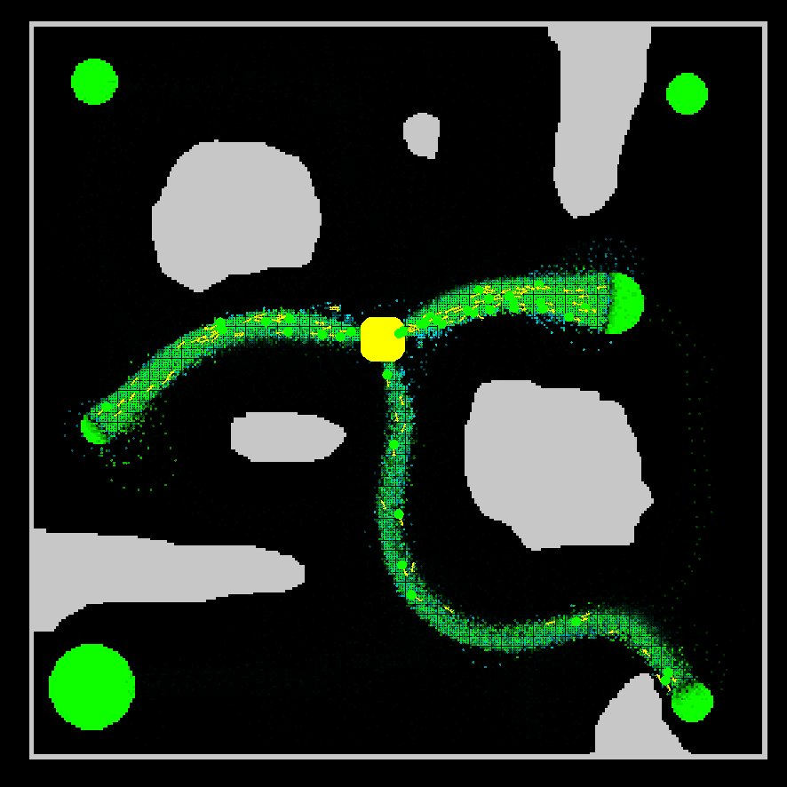

## **Ant colony simulator**
This simulates how ants work as a hive to find food. Ants place pheromones to tell other ants 
where they found food or where their base is. Blue dots represent "to colony" pheromones and 
green ones represent "to food" pheromones. When ants deplete a food source they will lay a
repellent and degrade any pheromone trails leading to that depleted food source to deter other
ants from venturing there.
\
\
**This project is coded in Java and uses LibGdx for rendering**

### Controls:
| Button/Key | Action                       |
|------------|------------------------------|
| WASD       | move camera                  |
| QE         | zoom in/out                  |
| YX         | toggle pheromones            |
| C          | toggle ants                  |
| HJK        | toggle colonies              |
| 123 Space  | Time scale                   |
| PL         | increase/decrease brush size |
| MMB        | place colony                 |
| LMB        | place wall                   |
| LMB + R    | remove wall                  |
| RMB        | place food                   |
| RMB + R    | remove food                  |

### References
[johnBuffer AntSimulator](https://github.com/johnBuffer/AntSimulator)\
[Sebastian Lague Ant Simulation](https://www.youtube.com/watch?v=X-iSQQgOd1A&t=508s)